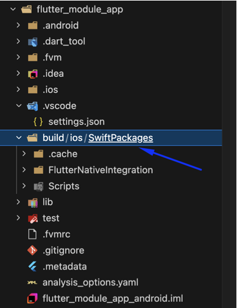
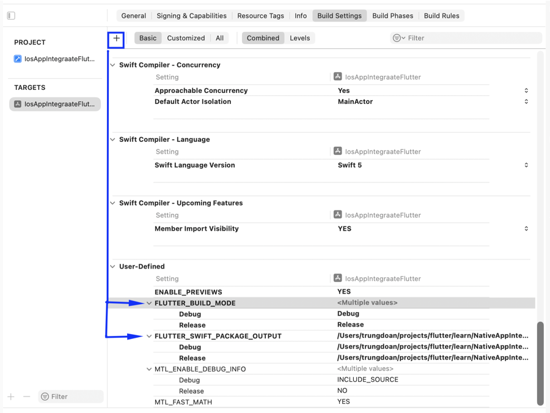
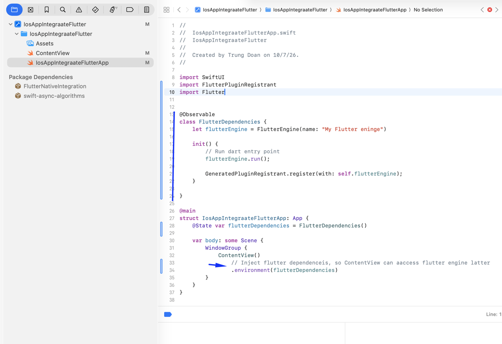
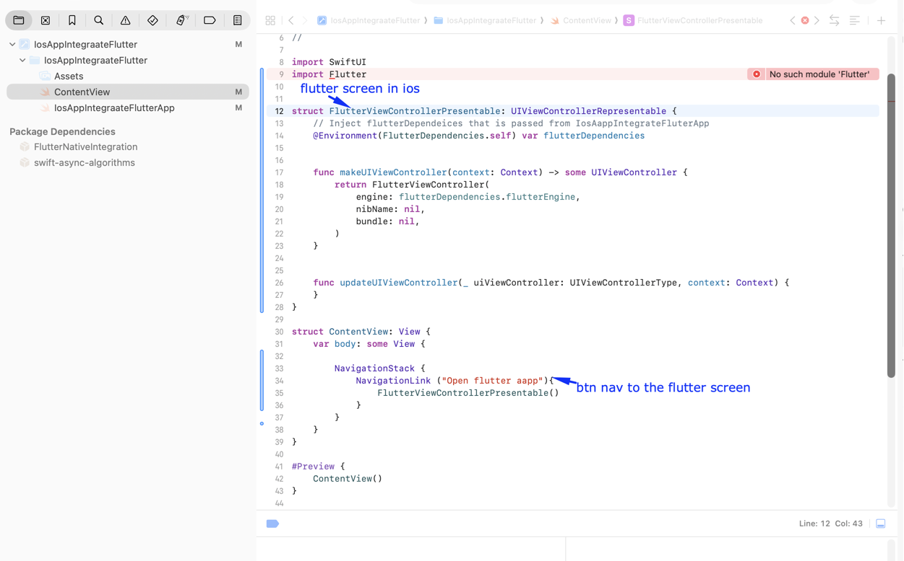

## Integrate Fluter app into Native Android/iOS app

- Prerequisites:
  - Flutter app / Flutter module
  - Native android app / Native ios app
- Prepare Flutter module:
  - If you have a existing flutter project, you need to convert it into a flutter module by adding these lines into pubspec.yaml
    ```
    module:
      androidX: true
      androidPackage: com.your_android_package_name
      iosBundleIdentifier: com.your_ios_bundle_id
    ```
  - Otherwise: create a flutter module by:
    ```
    flutter create -t module --org com.your_org module_name
    ```
- Integrate the flutter module into native Android app: [Complete guide](https://docs.flutter.dev/add-to-app/android/project-setup)
  - If your your flutter's android using gradle imperative format. Please follow this guide
    to migrate the gradle scripts to declarative format at: https://docs.flutter.dev/release/breaking-changes/flutter-gradle-plugin-apply

  - Configure gradle.settings.ts to include flutter native dependencies and your flutter module

    ```
    ...
    // Update dependencyResolutionManagement with flutter dependency repository
    (where to download fluter engine binary (c++) & flutter embedding lib (kotlin/java))
    dependencyResolutionManagement {
        repositoriesMode.set(RepositoriesMode.PREFER_SETTINGS)
        val storageUrl: String = System.getenv("FLUTTER_STORAGE_BASE_URL") ?: "https://storage.googleapis.com"
        repositories {
            google()
            mavenCentral()
            maven("$storageUrl/download.flutter.io")
        }
    }

    // Load flutter module dependency into native android project
    val filePath = settingsDir.parentFile.toString() + "/flutter_module_app/.android/include_flutter.groovy"
    apply(from = File(filePath))
    ```

  - Update app/build.gradle.ts to add your fluter module to the native android app

    ```
      dependencies {
          // ...
          // Add this line
          implementation(project(":flutter"))
      }
    ```

  - Config flutter activity:
    Run `flutter pub get` in the flutter module to genrate .android folder that will be loaded in a module in the native andorid project.

    Open the native android project

    Declare the flutter activity in manifest file by adding the below block into `<application>` tag

    ```
      <activity
          android:name="io.flutter.embedding.android.FlutterActivity"
          android:configChanges="orientation|keyboardHidden|keyboard|screenSize|locale|layoutDirectiofontScale|screenLayout|density|uiMode"
          android:hardwareAccelerated="true"
          android:windowSoftInputMode="adjustResize"
          />
    ```

  - Navigate to Flutter activity
    

    Done. FlutterActivity is the embeded flutter app in native app

- Integrate the flutter module into native iOS app: [Complete guide](https://docs.flutter.dev/add-to-app/ios/project-setup)  
  The config is different based on your native iOS using CocoaPods or Swift package manager
  - Config guide for ios project using Swift Package Manager
    - Run `flutter build swift-package --platform ios` to build your flutter module into a swift package
      (Add --no-codesign option to ignore code signing when you don't need to setup apple dev acc)
      => Output: 
    - Add the swift package to native iOS project:
      - Open iOS project
      - Right click on the ios project name, select 'Add Package Dependencies'
      - Select 'flutter_module_app/build/ios/SwiftPackages/FlutterNativeIntegration'
      - Complete
    - Add the package to ios build target
      - Select Targets > the iOS project
      - Select General tab, scroll down to 'Frameworks, Libraries, And Embedded Content'
      - Click + to add FlutterNativeIntegration package if it's not listed
    - Set FLUTTER_BUILD_MODE & FLUTTER_SWIFT_PACKAGE_OUTPUT in 'Build Settings' > 'User-Defined'
      - 
      - FLUTTER_SWIFT_PACKAGE_OUTPUT = $SRCROOT/../flutter_module_app/build/ios/SwiftPackages (flutter_module_app is fluter module name, change to your correct flutter module name)
    - Add pre-build script:
      - Select project name on top center near Simulator name
      - Click Edit scheme
      - Expand 'Build', select 'Pre-Actions'
      - Click +, select 'New Run Script Action'
      - Paste this script input the script input box:
        `/bin/sh $FLUTTER_SWIFT_PACKAGE_OUTPUT/Scripts/flutter_integration.sh prebuild`
    - Add Build Phase run script:
      - Select 'Build Phases' tab
      - Expand 'Run Script'
      - In Input File Lists, click + and paste:
        `$(FLUTTER_SWIFT_PACKAGE_OUTPUT)/Scripts/FlutterAssembleInputs.xcfilelist`
    - Setup navigate to flutter module screen in iOS
      - Config flutter engine dependencies
        

        ```
          import SwiftUI
          import FlutterPluginRegistrant
          import Flutter


          @Observable
          class FlutterDependencies {
              let flutterEngine = FlutterEngine(name: "My Flutter eninge")

              init() {
                  // Run dart entry point
                  flutterEngine.run();

                  GeneratedPluginRegistrant.register(with: self.flutterEngine);
              }

          }

          @main
          struct IosAppIntegraateFlutterApp: App {
              @State var flutterDependencies = FlutterDependencies()

              var body: some Scene {
                  WindowGroup {
                      ContentView()
                          // Inject flutter dependenceis, so ContentView can aaccess flutter engine latter
                          .environment(flutterDependencies)
                  }
              }
          }
        ```

      - Create FlutterViewControllerPresentable that is your flutter screen in iOS and add button nav to it
        

        ```
        struct FlutterViewControllerPresentable: UIViewControllerRepresentable {
            // Inject flutterDependeices that is passed from IosAappIntegrateFluterApp
            @Environment(FlutterDependencies.self) var flutterDependencies


            func makeUIViewController(context: Context) -> some UIViewController {
                return FlutterViewController(
                    engine: flutterDependencies.flutterEngine,
                    nibName: nil,
                    bundle: nil,
                )
            }


            func updateUIViewController(_ uiViewController: UIViewControllerType, context: Context) {
            }
        }

        struct ContentView: View {
            var body: some View {

                NavigationStack {
                    NavigationLink ("Open flutter aapp"){
                        FlutterViewControllerPresentable()
                    }
                }
            }
        }
        ```

        Complete! Run your ios app, click 'Open flutter app'. Then, your flutter app with counter UI will appear

  - Config guide for ios project using CocoaPods
    - [Config Podfile](https://docs.flutter.dev/add-to-app/ios/project-setup#set-local-network-privacy-permissions): Add these config to Podfile

      ```
      flutter_application_path = '../flutter_app'
      load File.join(flutter_application_path, '.ios', 'Flutter', 'podhelper.rb')

      # Pods for ios flutter app
      install_all_flutter_pods(flutter_application_path)

      post_install do |installer|
        flutter_post_install(installer) if defined?(flutter_post_install)
      end
      ```

      The complete Podfile:

      

    - Embed flutter module into ios app with Cocoapod:
      - cd to ios project folder
      - run `pod install`
    - [Edit Info-Debug.plist like below to enable debugging](https://docs.flutter.dev/add-to-app/ios/project-setup#set-local-network-privacy-permissions) the integrated Flutter app (via flutter attach).
      Note: don't edit in Info.plist (release). This config only need for debugging

      

    - Add Flutter screen to ios app
      - [Create FlutterEngine](https://docs.flutter.dev/add-to-app/ios/add-flutter-screen#create-a-flutterengine) & inject into ContentView

        

    - [Create Flutter view controller](https://docs.flutter.dev/add-to-app/ios/add-flutter-screen#show-a-flutterviewcontroller-with-your-flutterengine)

      

    - Navigate to the Flutter screen from native ios screen

      
